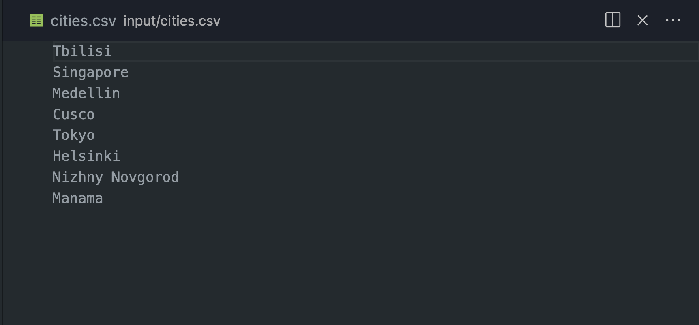
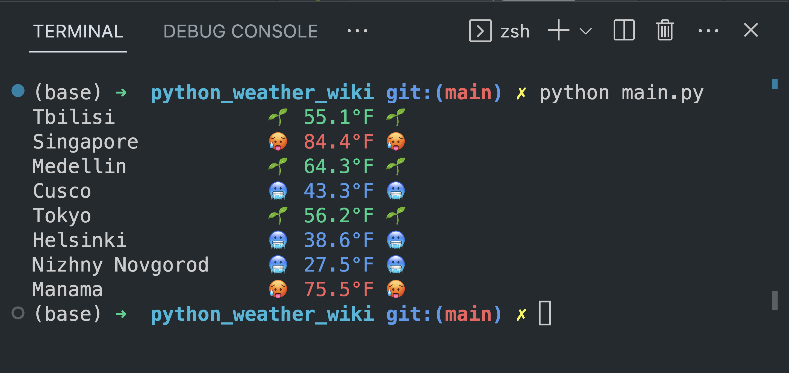

# Weather Finder


The Weather Finder is a command-line tool that retrieves the current weather of each city listed in a provided CSV file using the OpenWeatherMap API. It prints a running list of JSONs for each city in the console and saves the city names and temperatures in a new CSV file: `\setup\output.csv`.

> For a brief introduction to geodetic coordinates and how they relate to mapping the world, check out our blog post [Mapping the World: Geodetic and Euclidean Coordinates](https://patimejia.medium.com/mapping-the-world-e418a23db95b).

## Running the Weather Finder


Run the Weather Finder by executing the following command:

```
python main.py
```

## Dependencies

The Weather Finder depends on the following Python packages:

- `requests`
- `json`
- `csv`
- `typing`

These packages are listed in the `setup/requirements.txt` file in the root directory of this project.

### Installation

1. Install Python 3.9 from [here](https://www.python.org/downloads/).
2. Clone or download the Weather Finder repository from GitHub.
3. Open a terminal or command prompt and navigate to the root directory of the project.
4. Install the required Python packages by running the following command:

```
pip install -r setup/requirements.txt
```

## `input.csv` example



## `output.csv` example



## Testing

The Weather Finder uses `pytest` as a testing framework. To run the tests, make sure `pytest` is installed (you can install it by running `pip install pytest` in the terminal), then run `pytest` in the terminal from the root directory of this project:

```
pytest
```

## API Key

> The following step is optional and it might take 1-2 minutes

The Weather Finder uses the OpenWeatherMap API to retrieve weather data. If the included API key is no longer valid, you can generate your own API key by creating an account [here](https://home.openweathermap.org/users/sign_up).

Once you create an account and log in, you can quickly generate a new API Key [here](https://home.openweathermap.org/api_keys).

After you generate your API key, you can add it to the Weather Finder by replacing the `API_KEY` variable in `setup/api_key.txt` with your API key.

## Contributing

If you would like to contribute to the Weather Finder project, please fork the repository and submit a pull request. We welcome contributions of all kinds, including bug fixes, new features, and documentation.

## Roadmap


1. ✅ Created the `get_api_key()` function to read an API key from a file.
1. ✅ Created the `read_csv_file()` function to read a list of cities from a CSV file.
1. ✅ Created the `get_city_weather()` function to retrieve weather data for a given city using the OpenWeatherMap API.
1. ✅ Created the `write_to_csv()` function to write the city name and temperature to a CSV file.
1. ✅ Modified the main code block to print the city name and temperature to the console with pretty styling.
1. ✅ Added testing for the `test_api_key()` function using `pytest`.
1. ✅ User Input Validation: Currently, the program assumes that the provided CSV file is correctly formatted and that the API key is valid. In the future, input validation could be implemented to handle cases where the input is incorrect or incomplete.
1. 🫙 Error Handling: The program currently prints error messages to the console when an error occurs, but does not handle errors gracefully or provide specific information on what went wrong. In the future, more robust error handling could be implemented to provide users with more useful feedback.
1. 🫙 Additional Functionality: Currently, the Weather Finder only retrieves and saves the temperature data for each city. In the future, additional weather data, such as wind speed or precipitation, could also be retrieved and saved to the CSV file.
1. 🫙 Advanced Search Parameters: The program could be expanded to allow users to specify their preferred temperature unit (e.g. Celsius, Fahrenheit or Kelvin) or to provide more advanced search parameters, such as time ranges, weather conditions or [geodetic coordinates](https://patimejia.medium.com/mapping-the-world-e418a23db95b), to retrieve more specific weather data.

## License

The Weather Finder is licensed under the MIT License. See the LICENSE file for more information.

## Contact

If you have any questions, please contact me at [contact@patimejia.com
](mailto:contact@patimejia.com)

## Acknowledgements

- [OpenWeatherMap API](https://openweathermap.org/api)
